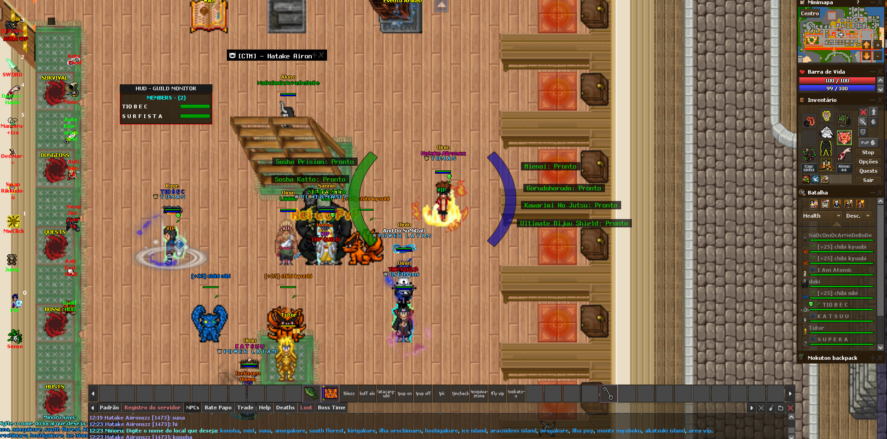

# 📑 Release Notes - Versão 1.2.0

Esta versão traz uma nova funcionalidade. HUD de guild. 

Com essa funcionalidade, o player consegue visualizar todos os membros da guild proximos. Bem como sua vida em tempo real. 

# 📑 Release Notes - Versão 1.1.0

Esta versão traz melhorias críticas de estabilidade, otimização de algoritmos de combate e novas funcionalidades de segurança.

## 🚀 Novidades e Melhorias

### 🛠️ Correções e Estabilidade (Fixes)
* **BugMap Corrigido:** Agora funcionando perfeitamente com `W, A, S, D`, `Setas` e `Teclado Numérico`.
* **Carregamento de Ícones:** Corrigido o erro (vermelho) que ocorria ao carregar a Custom devido a falhas na busca de ícones.
* **Layout Limpo:** Remoção do *Life Percent* antigo que causava bugs visuais em diferentes resoluções e layouts.

### ⚡ Sistema de Magias (Spells & Heals)
* **Instant Spell Heal:** Agora, ao digitar o nome da magia, ela é adicionada e exibida instantaneamente na tabela.
* **OnScreen Display:** Adicionada a opção de setar a magia *onScreen* tanto em **Manual Keys** quanto em **Fuga Keys**, permitindo visualizar a magia ativa diretamente na tela.
* **Ajuste Visual:** Ícone de *Sense (Shift + F)* ajustado para melhor visibilidade.

### 🛡️ Inteligência Artificial e Combate
* **Algoritmo de Fuga 2.0:** * Priorização inteligente baseada em Cooldown e Combo.
    * **Gestão de Dano:** Se o personagem estiver combando mas recebendo dano crítico, o bot pausa o ataque momentaneamente para priorizar a Fuga ativa, evitando o *exhaust* e garantindo a sobrevivência.
* **Prioridade de Fuga:** Removida a caixa de texto de prioridade. Agora utilize os botões **Move Up/Move Down** para definir a ordem de execução (estilo New Tyr).

### 🛑 Segurança (Anti-RedSkull)
* **Nova Macro Anti-RS:** Monitoramento ativo de risco. Se o **Cave Hunt** estiver ligado e você entrar em situação de risco de RedSkull, o bot desativa automaticamente as macros de ataque e liga o **PVP OFF**. Ideal para quem esquece de configurar após o PK/Pelego.

### 🎨 Customização
* **Background Customizado:** Agora você pode alterar a imagem de fundo da Custom. Basta substituir o arquivo na pasta:
    `%AppData%\Roaming\OTClientV8\NTO LOST\bot\CUSTOM_HTK\img`

    Obs: pode ser qualquer imagem .png, mas tem q ter exatamente esse nome -> backgroundcustom

---

## ⚠️ Observações Importantes (Leia!)
> Se notar qualquer inconsistência após a atualização:
> 1. Zere as **Fugas** e as **Manual Keys**.
> 2. Adicione-as novamente.
> 3. Assim que adicionar, execute a fuga uma vez para inicializar corretamente o contador de Cooldown (CD).

---
