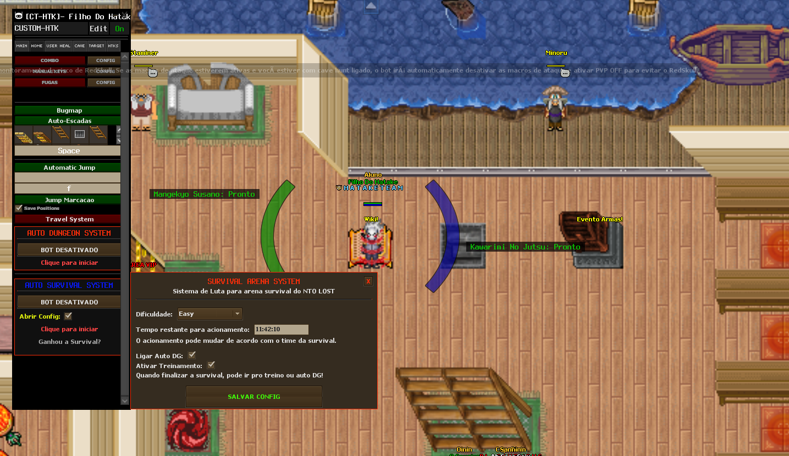
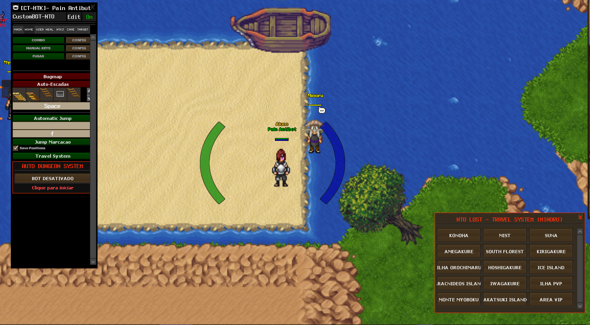
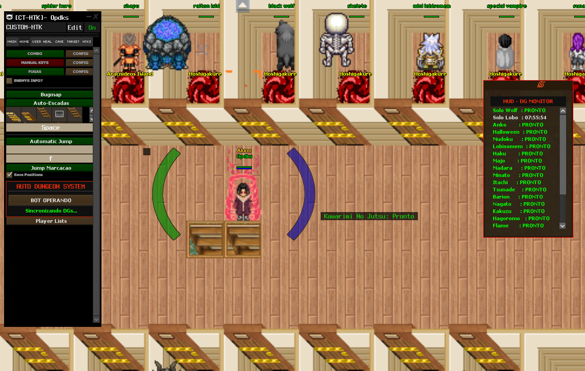
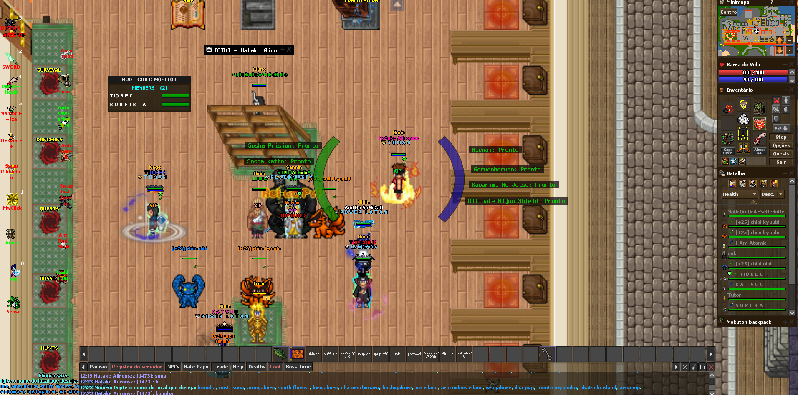

# 📑 Release Notes - Versão 2.4.0
   - Essa versão traz uma nova DG para o sistema de DG
   - Dungeon NAGAI - é necessario que seja um player Rank S+, caso seu personagem nao tenha a dungeon é skipada!
   - Obs: Realize o download da custom para obter as novas atualizações e evitar BUGs;

# 📑 Release Notes - Versão 2.3.0
   - Essa versão traz novas macros e a funcionalidade de Auto Survival System
   - Auto Survival System
      * Permite ao jogador realizar a arena de survival do NTO-LOST de acordo com o nivel de dificuldade configurado.
      * Arena survival pode ser realizada a cada 12 horas. Durante este periodo, o sistema da a opção de continuar o auto dungeon ou simplesmente ir para o treino.
      * Garantindo um ciclo de Farm e treinamento continuo!
    
   
        

     
# 📑 Release Notes - Versão 2.2.3
   - Ajustes no travel system
     
# 📑 Release Notes - Versão 2.2.2
   - Ajustes markdown

# 📑 Release Notes - Versão 2.2.1
   - Ajustes no storage de fuga spells, key spells e combo spells;
   - Caso haja algum bug, refaça suas fugas.

# 📑 Release Notes - Versão 2.2.0
   Essa versão traz uma nova funcionalidade para o NTO-LOST - Travel System.
   
   Ao falar hi no NPC Minoru - É exibido um HUD com as opções de viagem. Uma vez que clicado na opção desejada o travel é realizado.
   
   Obs: Quando o auto-DG esta ligado o sistema de travel é desativado!
   
   
   
   
# 📑 Release Notes - Versão 2.1.1
   Essa versão traz ajustes

   1: Ajuste macro de captcha
   
# 📑 Release Notes - Versão 2.1.0
   Essa versão traz ajustes e novas macros -
   
   1: Macro: Auto IK - Abre um painel onde o jogador pode colocar a magia utilizada para da IK no alvo e a porcentagem de vida que o alvo deve ter para ser acionada.
      Obs: A macro verifica se o jogador esta com alguma fuga defensiva em cooldown, caso esteja o IK nao é acionado. 

   2: Macro: Desviar BOSS - que monitora o tile onde o player esta e se detectar um efeito perigoso, move para fora da area. Nao funciona para area estilo do Lobisomem BOSS. Desligue quando estiver com AUTO-DG ON
      Obs: Util para bosses: Com efeitos 1,2,3 - area vermelha
      
   
# 📑 Release Notes - Versão 2.0.2
   Essa versão traz ajustes no AUTO-DG;
   
# 📑 Release Notes - Versão 2.0.1
   Essa versão traz um novo script de anti-catpcha para os NPC de benisu e port island - Agora só é necessario falar hi no NPC e o travel funciona automaticamente. 
   
# 📑 Release Notes - Versão 2.0.0
   Essa versão traz novas macros e a funcionalidade de AUTO-DG (Auto Dungeon System)
   1) O AUTO DG Permite ao jogador automizar 13 dungeons do jogo NTO-LOST, dessa forma é possivel agora realizar dungeons automaticamente, uma vez que finalizada o ciclo de dungeons o jogador vai automaticamente para o treino    e quando uma DG é liberada o cooldown - sai do treino e vai realiza-la. 
   Obs: Para Dungeons que precisa de chaves, como special tsunade, special obito, é necessario ter a chave na bag principal e esta com ela aberta. Dessa forma o autoDG consegue identificar a chave, se nao tiver chave ou a    bag estiver fechada a DG é pulada para a proxima.

   Obs: É Necessário deixar o painel de "Boss cooldown" aberto.
   

   3) Nova macro anti selo especial (caso o jogador esteja selado por um selo de especial e estiver tomando muito dano, quando estiver com kawarimi no jutsu disponivel a macro bate a magia automaticamente, priorizando a sobrevivencia do personagem.

   

# 📑 Release Notes - Versão 1.2.3
Esta versão traz melhorias e ajustes;
Ajuste no Key Pressed das fugas.
Melhoria na macro antiRedSkull.

# 📑 Release Notes - Versão 1.2.2
Esta versão traz melhorias e ajustes;
Novo Loader - realize o download do novo loader;

# 📑 Release Notes - Versão 1.2.1
Esta versão traz melhorias e ajustes;
Macro Anti Gank com novo layout.
Macro Anti Kawarimi Selo com verificação adicional.

# 📑 Release Notes - Versão 1.2.0

Esta versão traz uma nova funcionalidade. HUD de guild. 

Com essa funcionalidade, o player consegue visualizar todos os membros da guild proximos. Bem como sua vida em tempo real. 

# 📑 Release Notes - Versão 1.1.0

Esta versão traz melhorias críticas de estabilidade, otimização de algoritmos de combate e novas funcionalidades de segurança.

## 🚀 Novidades e Melhorias

### 🛠️ Correções e Estabilidade (Fixes)
* **BugMap Corrigido:** Agora funcionando perfeitamente com `W, A, S, D`, `Setas` e `Teclado Numérico`.
* **Carregamento de Ícones:** Corrigido o erro (vermelho) que ocorria ao carregar a Custom devido a falhas na busca de ícones.
* **Layout Limpo:** Remoção do *Life Percent* antigo que causava bugs visuais em diferentes resoluções e layouts.

### ⚡ Sistema de Magias (Spells & Heals)
* **Instant Spell Heal:** Agora, ao digitar o nome da magia, ela é adicionada e exibida instantaneamente na tabela.
* **OnScreen Display:** Adicionada a opção de setar a magia *onScreen* tanto em **Manual Keys** quanto em **Fuga Keys**, permitindo visualizar a magia ativa diretamente na tela.
* **Ajuste Visual:** Ícone de *Sense (Shift + F)* ajustado para melhor visibilidade.

### 🛡️ Inteligência Artificial e Combate
* **Algoritmo de Fuga 2.0:** * Priorização inteligente baseada em Cooldown e Combo.
    * **Gestão de Dano:** Se o personagem estiver combando mas recebendo dano crítico, o bot pausa o ataque momentaneamente para priorizar a Fuga ativa, evitando o *exhaust* e garantindo a sobrevivência.
* **Prioridade de Fuga:** Removida a caixa de texto de prioridade. Agora utilize os botões **Move Up/Move Down** para definir a ordem de execução (estilo New Tyr).

### 🛑 Segurança (Anti-RedSkull)
* **Nova Macro Anti-RS:** Monitoramento ativo de risco. Se o **Cave Hunt** estiver ligado e você entrar em situação de risco de RedSkull, o bot desativa automaticamente as macros de ataque e liga o **PVP OFF**. Ideal para quem esquece de configurar após o PK/Pelego.

### 🎨 Customização
* **Background Customizado:** Agora você pode alterar a imagem de fundo da Custom. Basta substituir o arquivo na pasta:
    `%AppData%\Roaming\OTClientV8\NTO LOST\bot\CUSTOM_HTK\img`

    Obs: pode ser qualquer imagem .png, mas tem q ter exatamente esse nome -> backgroundcustom

---

## ⚠️ Observações Importantes (Leia!)
> Se notar qualquer inconsistência após a atualização:
> 1. Zere as **Fugas** e as **Manual Keys**.
> 2. Adicione-as novamente.
> 3. Assim que adicionar, execute a fuga uma vez para inicializar corretamente o contador de Cooldown (CD).

---
